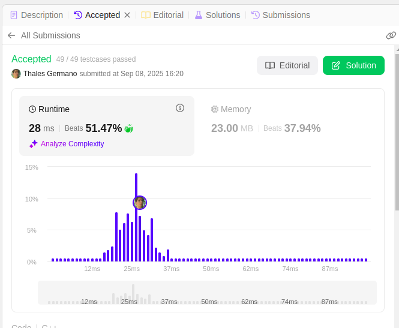
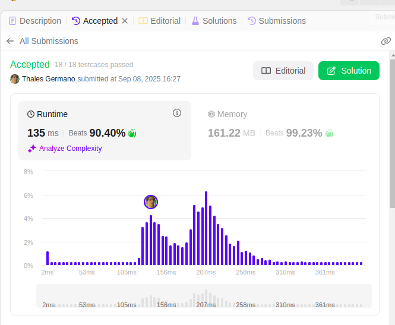
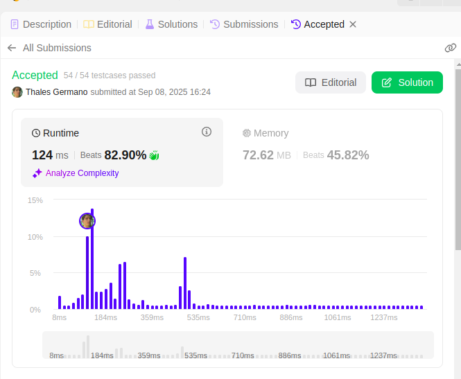

# Exercícios de Grafos 1

**Número da Lista**: 1 
**Conteúdo da Disciplina**: FGA0124 - PROJETO DE ALGORITMOS  

## Alunos

<div align = "center">
<table>
  <tr>
    <td align="center"><a href="https://github.com/thalesgvl"><br /><sub><b>Thales Germano Vargas Lima</b></sub></a></td>
    <td align="center"><a href="https://github.com/vcpVitor"><br /><sub><b>Vitor Carvalho Pereira</b></sub></a></td>
  </tr>
</table>

| Matrícula       | Aluno              |
| --------------- | ------------------ |
| 20/2017147 | Thales Germano Vargas Lima |
| 21/1062615 | Vitor Carvalho Pereira |
</div>

## Sobre 
A atividade foi baseada na resolução de desafios de programação da plataforma LeetCode.  
Foram selecionados **3 exercícios** de grafos, abrangendo BFS e DFS, em diferentes níveis de dificuldade (médio e difícil).

## Exercícios 

---

### [200. Number of Islands](https://leetcode.com/problems/number-of-islands/) – Medium  

Dada uma grade binária, determine o número de **ilhas** (blocos conectados de `'1'`).  
Conexões só contam nas 4 direções (cima, baixo, esquerda, direita).

**Exemplo**

Entrada:  
```
grid = [
  ["1","1","0","0","0"],
  ["1","1","0","0","0"],
  ["0","0","1","0","0"],
  ["0","0","0","1","1"]
]
```  
Saída: `3`

**Ideia**

- Percorrer toda a grade.  
- Ao encontrar `'1'`, executar **DFS/BFS** para “afundar” a ilha, marcando como visitado.  
- Incrementar contador de ilhas.  

**Prints**

<p align="center">
  
</p>

---

### [1192. Critical Connections in a Network](https://leetcode.com/problems/critical-connections-in-a-network/) – Hard  

Encontrar todas as **arestas críticas** (bridges) em uma rede de servidores.

**Exemplo**

Entrada:  
```
n = 4, connections = [[0,1],[1,2],[2,0],[1,3]]
```
Saída:  
```
[[1,3]]
```

**Ideia**

- Usar **Tarjan + DFS** com arrays `disc[]` e `low[]`.  
- Uma aresta `(u,v)` é crítica se `low[v] > disc[u]`.  

**Prints**

<p align="center">
  
</p>

---

### [815. Bus Routes](https://leetcode.com/problems/bus-routes/) – Hard  

Calcular o **menor número de ônibus** necessários para ir de `source` até `target`.

**Exemplo**

Entrada:  
```
routes = [[1,2,7],[3,6,7]], source = 1, target = 6
```
Saída: `2`  

**Ideia**

- Construir mapa **stop → rotas**.  
- Rodar **BFS** a partir de `source`.  
- Cada camada da BFS = tomar mais um ônibus.  
- Usar `visitedRoutes` e `visitedStops` para evitar repetições.  

**Prints**

<p align="center">
  
</p>

---

## Apresentação 

<div align="center">
<a href="https://youtu.be/ZyilJqMZE60"></a>

<font size="3"><p style="text-align: center">Autores: [Thales Germano Vargas Lima](https://github.com/thalesgvl) & [Vitor Carvalho Pereira](https://github.com/vcpVitor)</p></font>
</div>
